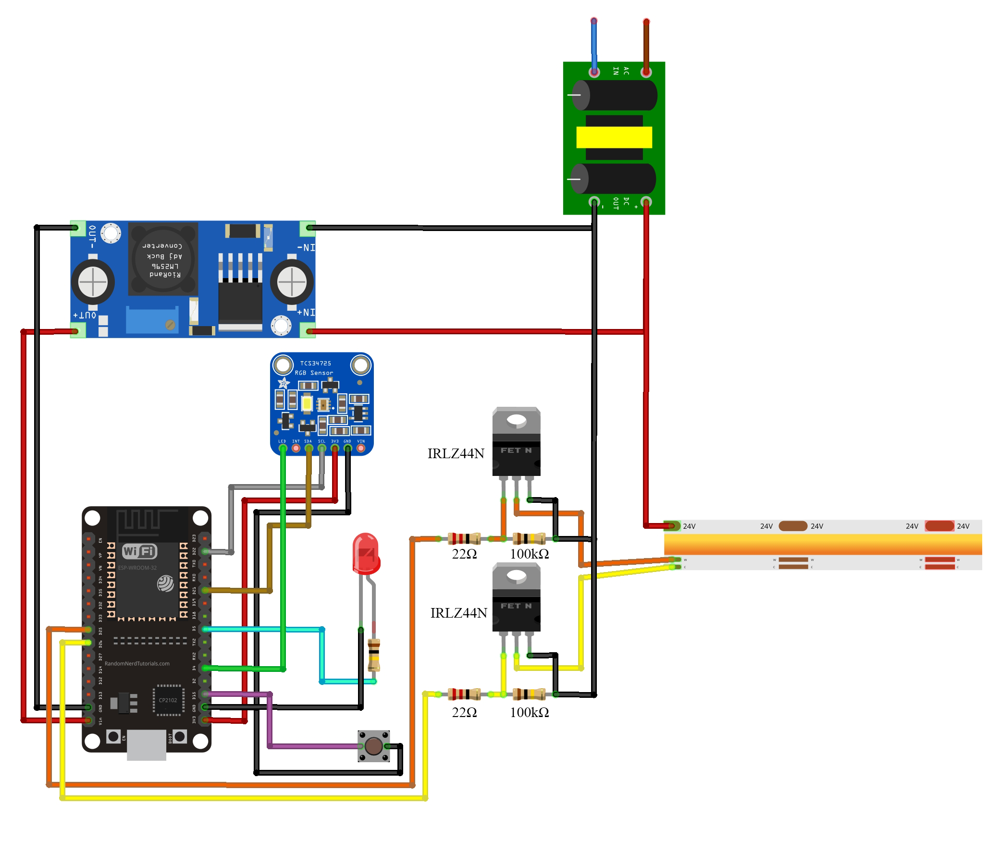

# CircadiaLux – IoT Component

This directory contains all the hardware designs, firmware, and simulation files related to the IoT component of the CircadiaLux project.

## Overview

The IoT component is responsible for collecting environmental data and controlling lighting based on circadian rhythm patterns. This system uses an ESP32 microcontroller connected to a TCS34725 color sensor to measure ambient light conditions and control a dual-channel LED strip (warm white and cool white) to provide circadian rhythm-friendly lighting.

## Hardware Requirements

| Component | Quantity |
|-----------|----------|
| ESP32 development board | 1 |
| TCS34725 color sensor | 1 |
| IRLZ44N MOSFET | 2 |
| 100kΩ resistor | 3 |
| 22Ω resistor | 2 |
| LM2596 buck convertor | 1 |
| Dual-channel LED strip - COB CCT | 1 |
| Push button | 1 |
| Status LED | 1 |

## Features

- **WiFi Manager**: Setup mode with access point for configuring WiFi credentials
- **Supabase Integration**: Retrieves lighting settings based on time and user ID
- **Time-based Control**: Adjusts lighting parameters at specific times (hourly and half-hourly)
- **Sensor Feedback**: Measures actual light conditions and adjusts output accordingly
- **Simple Control System**: Implements proportional control for CCT and brightness

## Firmware Structure

- **Main Control** (`firmware.cpp`): Orchestrates the overall system behavior
- **Sensor Module** (`sensor.cpp`, `sensor.h`): Manages the TCS34725 color sensor
- **Light Control Module** (`lightcontrol.cpp`, `lightcontrol.h`): Controls the LED outputs
- **WiFi Manager** (`wifimanager.cpp`, `wifimanager.h`): Handles WiFi configuration
- **Database Integration** (`getdetails.cpp`, `getdetails.h`): Manages Supabase interaction

## Circuit Diagram



## Setup and Configuration

1. Make circuit according to the diagram above
2. Copy `firmware/src/config.cpp.example` to `firmware/src/config.cpp`
3. Edit `config.cpp` with your specific configuration:
   - Device ID
   - Supabase URL and anonymous key
   - Pin assignments (if needed)
   - NTP server settings

## Getting Started

1. Install [PlatformIO](https://platformio.org/) for your IDE
2. Configure your settings in `config.cpp` as described above
3. Build and upload to your ESP32

## Initial WiFi Setup

When first powered on or after a reset:

1. Press and hold the reset button (pin 15) for 3 seconds
2. Connect to the "CircadiaLux-Setup" WiFi access point
3. Navigate to http://192.168.4.1 in your browser (or try http://circadialux.local)
4. Enter your WiFi credentials
5. The device will restart and connect to your WiFi network

## Status Light Indicators

The status LED provides visual feedback about the device's current state:

| LED Pattern | Meaning |
|-------------|---------|
| Blinking | Attempting to connect to WiFi network |
| Solid on | WiFi setup mode (AP mode) active |
| Off | Successfully connected to WiFi |

## How It Works

1. The system connects to WiFi and synchronizes time with an NTP server
2. Based on the current time, it fetches appropriate lighting settings from Supabase
3. The color sensor continuously monitors the actual lighting conditions
4. The control system adjusts the warm white and cool white LED channels to match the target settings
5. Settings are updated automatically every hour and half-hour

## Dependencies

Required libraries (automatically managed by PlatformIO):

- Adafruit TCS34725
- ESPSupabase
- ESPAsyncTCP
- ESPAsyncWebServer
- ArduinoJson

## Project Structure

```
firmware/
├── include/               # Project header files
├── lib/                   # Project libraries
├── platformio.ini         # PlatformIO configuration
├── src/                   # Source code
│   ├── config.cpp.example # Configuration template
│   ├── config.h           # Configuration header
│   ├── firmware.cpp       # Main application code
│   ├── getdetails.cpp     # Supabase integration
│   ├── getdetails.h
│   ├── lightcontrol.cpp   # LED control functions
│   ├── lightcontrol.h
│   ├── sensor.cpp         # Color sensor functions
│   ├── sensor.h
│   ├── wifimanager.cpp    # WiFi configuration interface
│   └── wifimanager.h
└── test/                  # Test files
simulation/                # Proteus simulation files
Diagram.fzz                # Fritzing circuit diagram
Diagram.png                # Circuit diagram
```
---
For license and contribution info, see the [main README](../README.md).